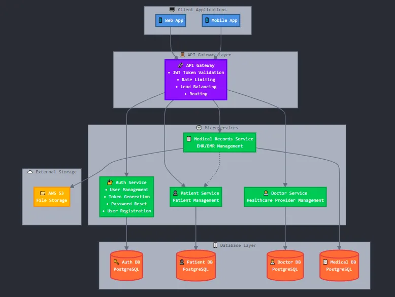

# medisync - Microservices-Based Healthcare Management System

**medisync** is a backend healthcare management system built using a
modern microservices' architecture. The project is being
developed in **Java** with **Spring Framework**, and each microservice is responsible
for a separate domain, backed by its own dedicated MySQL database.

---

## 🚧 Development Status

✅ **Implemented Services:**

- `eureka-server` – Service Discovery and Registration
- `api-gateway` – API Gateway with routing and load balancing
- `auth-service` – User authentication and authorization
- `doctor-service` – Doctor profile and management
- `patient-service` – Patient profile and management

---

## 🧱 System Architecture Overview

The system is structured in the following layers:

1. **Client Applications**
    - Web Application
    - Mobile Application

2. **Service Discovery**
    - **Eureka Server**: Central registry for all microservices

3. **API Gateway**
    - Handles:
        - JWT Token validation
        - Routing
        - Rate Limiting
        - Load Balancing
        - Service Discovery integration

4. **Microservices**
    - `Auth Service`: User registration, login, password reset
    - `Patient Service`: Patient profile management
    - `Doctor Service`: Doctor availability and profile
    - `Medical Records Service` (planned): EHR/EMR management
    - **Each service has its own database**

5. **External Storage**
    - AWS S3 (planned) for storing medical documents and images

6. **Database Layer**
    - Individual databases per service: `medisync_auth_db`, `medisync_doctor_db`, `medisync_patient_db`

---

## 🗺️ System Architecture

Below is the system architecture diagram of medisync:



---

## 🛠️ Tech Stack

- **Java 17**
- **Spring Boot** - Microservices framework
- **Spring Cloud Netflix Eureka** - Service Discovery
- **Spring Cloud Gateway** - API Gateway
- **Spring Data JPA** - Data persistence
- **Jakarta EE** - Enterprise Java specifications
- **Lombok** - Code generation
- **MySQL** - Database
- **Microservices Architecture**
- **REST APIs**
- **JWT Authentication**
- **Maven** - Build tool
- **IntelliJ IDEA** - Development IDE

---

## 🏗️ Current Microservices

### 1. Eureka Server
- **Purpose**: Service discovery and registration
- **Port**: 8761 (default)
- **Features**: 
  - Central registry for all microservices
  - Health monitoring
  - Load balancing support

### 2. API Gateway
- **Purpose**: Single entry point for all client requests
- **Features**:
  - Request routing to appropriate microservices
  - JWT token validation
  - Rate limiting
  - Load balancing
  - Service discovery integration

### 3. Auth Service
- **Purpose**: User authentication and authorization
- **Features**:
  - User registration and login
  - JWT token generation and validation
  - Password management
  - Role-based access control

### 4. Doctor Service
- **Purpose**: Doctor profile and management
- **Features**:
  - Doctor profile management
  - Availability scheduling
  - Specialization management

### 5. Patient Service
- **Purpose**: Patient profile and management
- **Features**:
  - Patient profile management
  - Medical history tracking
  - Personal information management

---

## 📅 To Do (Planned Features)

- Add Medical Records Service (EHR/EMR)
- Add Appointment Service
- Add Notification Service
- Integrate Message Broker (e.g., Kafka or RabbitMQ)
- CI/CD Pipeline
- Docker & Kubernetes support
- Monitoring and Logging (ELK Stack)
- Database migration to PostgreSQL

---

## 🚀 Getting Started

### Prerequisites
- Java 17
- Maven 3.6+
- MySQL 8.0+
- IntelliJ IDEA (recommended)

### Running the Services

1. **Start Eureka Server**
   ```bash
   cd eureka-server
   mvn spring-boot:run
   ```

2. **Start API Gateway**
   ```bash
   cd api-gateway
   mvn spring-boot:run
   ```

3. **Start Microservices**
   ```bash
   # Auth Service
   cd auth-service
   mvn spring-boot:run
   
   # Doctor Service
   cd doctor-service
   mvn spring-boot:run
   
   # Patient Service
   cd patient-service
   mvn spring-boot:run
   ```

### Service URLs
- Eureka Dashboard: `http://localhost:8761`
- API Gateway: `http://localhost:8080`
- Auth Service: `http://localhost:8081`
- Doctor Service: `http://localhost:8082`
- Patient Service: `http://localhost:8083`

---

## 👨‍💻 Developer Note

> This is a personal learning project aimed at building backend experience using real-world architectural patterns and modern Spring Cloud technologies.

---

## 📌 Notes

- Each microservice uses its own database for data isolation
- Services are registered with Eureka for dynamic discovery
- Inter-service communication is currently via REST APIs
- All external requests go through the API Gateway
- Architecture is modular and extensible
- Uses Jakarta EE specifications for enterprise features